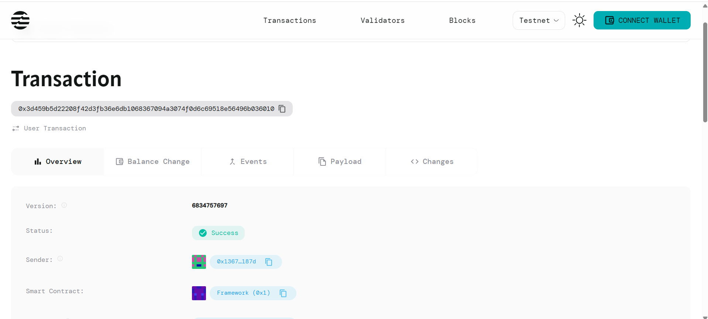

# Allowlist Management

## Project Description

A dynamic allowlist management system built on the Aptos blockchain using Move smart contracts. This system enables administrators to create and manage time-based access control lists where addresses can be granted temporary permissions that automatically expire after a specified timestamp. The solution provides a secure, decentralized approach to managing user access with built-in expiration mechanisms.

## Project Vision

Our vision is to create a robust, scalable allowlist management infrastructure that serves as a foundation for various blockchain applications requiring time-sensitive access control. We aim to provide developers and organizations with a simple yet powerful tool to implement dynamic permission systems, from NFT whitelisting and ICO participation to exclusive event access and premium service subscriptions.

By leveraging the security and efficiency of the Aptos blockchain, we enable transparent, immutable, and automatically enforced access controls that eliminate the need for centralized permission management while ensuring fair and time-bound access to resources.

## Key Features

### ✨ Dynamic Allowlist Creation
- **Flexible Entry Management**: Administrators can add addresses to the allowlist with custom expiration timestamps
- **Automatic Initialization**: Smart contract automatically sets up the allowlist manager when first used
- **Scalable Architecture**: Designed to handle multiple entries efficiently without performance degradation

### ⏰ Time-Based Expiration
- **Automatic Expiry**: Entries automatically become invalid after their specified expiration time
- **Real-time Validation**: Uses Aptos blockchain timestamp for accurate time-based access control
- **No Manual Intervention**: Expired entries are automatically excluded without requiring additional transactions

### 🔐 Security Features
- **Admin-Only Control**: Only authorized administrators can add entries to the allowlist
- **Immutable Records**: Once deployed, the allowlist logic cannot be tampered with
- **Transparent Operations**: All allowlist operations are recorded on-chain for full transparency

### 🚀 Developer-Friendly
- **Simple API**: Just two core functions for maximum ease of use
- **Gas Efficient**: Optimized for minimal transaction costs
- **Integration Ready**: Easy to integrate into existing dApps and blockchain applications

## Future Scope

### Phase 1 - Enhanced Management
- **Bulk Operations**: Add multiple addresses to the allowlist in a single transaction
- **Entry Modification**: Allow administrators to update expiration times for existing entries
- **Removal Functionality**: Implement immediate entry removal before expiration

### Phase 2 - Advanced Features
- **Multi-Admin Support**: Enable multiple administrators with different permission levels
- **Category-Based Lists**: Support for multiple allowlists with different purposes
- **Automatic Renewal**: Optional automatic extension of expiration dates

### Phase 3 - Enterprise Integration
- **API Gateway**: RESTful API for easy integration with traditional applications
- **Analytics Dashboard**: Web interface for monitoring allowlist usage and statistics
- **Cross-Chain Compatibility**: Extend functionality to other blockchain networks

### Phase 4 - DeFi Integration
- **Stake-to-Access**: Require token staking for allowlist entry
- **Reputation System**: Integrate with on-chain reputation systems
- **Governance Integration**: Community-driven allowlist management through DAO voting

## Contract Details
0x3d459b5d22208f42d3fb36e6db1068367094a3074f0d6c69518e56496b036010

